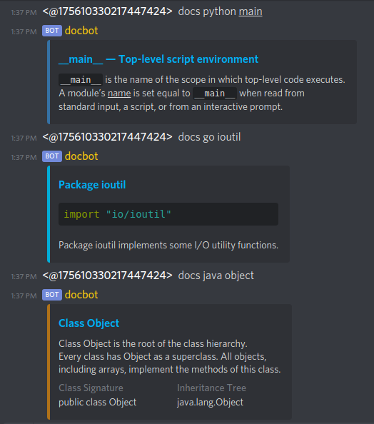

# docbot

Because documentation is important and so is convenience.

How to use:
- `go get github.com/rxcmr/docbot`
- go build
- create .env file in resources folder (make the dir first) or export your DISGORD_TOKEN
- download javadocs and godocs and place them in resources
- profit?

### Sample 
